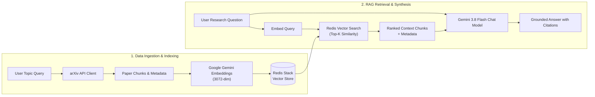

<div align="center">
  
  <h1>ResearchMate</h1>
  <p><strong>Intelligent Academic Research Assistant powered by Redis Vector Search and Google Gemini</strong></p>

  [](https://www.python.org/)
  [](https://streamlit.io/)
  [](https://redis.io/)
  [](https://ai.google.dev/)
  [](https://python.langchain.com/)
</div>

---

## 📖 Overview

**ResearchMate** transforms any scientific research topic into a **topic-scoped Redis Vector Index** on the fly. It fetches the latest peer-reviewed and preprint papers directly from the arXiv API, parses and normalizes their abstracts and metadata, creates high-dimensional vector embeddings using **Google Gemini**, and provides a conversational RAG interface where every answer is strictly grounded in academic literature with verifiable paper citations.

---

## ✨ Key Features

- **Dynamic arXiv Paper Ingestion**: Fetch papers across any scientific domain (computer science, physics, biology, mathematics, etc.) with automatic rate-limiting and exponential backoff.
- **Topic-Scoped Redis Vector Indices**: Isolate research domains with clean Redis prefixes (`researchmate:doc:<topic>:`) and dedicated schemas.
- **State-of-the-Art Gemini Models**: Utilizes `models/gemini-3.8-flash` for ultra-fast, high-quality reasoning and `models/gemini-embedding-2` for 3072-dimensional semantic embeddings.
- **Grounded Academic Citations**: Every response references specific retrieved papers, displaying paper titles, author lists, and direct links to the arXiv entries.
- **Paper-Wise Summaries & Key Findings**: Review all fetched paper titles, author lists, categories, arXiv links, and formatted abstracts in dedicated summary cards before diving into Q&A.
- **Production-Ready Structure**: Clean modular architecture (`src/researchmate/`), comprehensive test suite, Docker orchestration, and one-click launch scripts for Windows, Linux, and macOS.

---

## 🏗️ System Architecture



---

## 📁 Project Structure

```text
ResearchMate/
├── .env.example              # Environment variables template
├── .env                      # Active local configuration (git-ignored)
├── .gitignore                # Git ignore rules
├── .dockerignore             # Docker build ignore rules
├── Dockerfile                # Production container specification
├── docker-compose.yml        # Multi-container orchestration (App + Redis Stack)
├── Makefile                  # Cross-platform developer commands
├── pyproject.toml            # Poetry & build configuration
├── requirements.txt          # Production Python dependencies
├── requirements-dev.txt      # Testing and development dependencies
├── README.md                 # Project documentation
├── assets/                   # Logos, diagrams, and media
│   ├── researchmate_logo.png # Project brand logo
│   ├── diagram.png           # Architecture diagram (light)
│   └── diagram-dark.png      # Architecture diagram (dark)
├── src/
│   └── researchmate/         # Core application package
│       ├── __init__.py       # Package exports & version
│       ├── config.py         # Type-safe settings & environment management
│       ├── arxiv.py          # arXiv paper query & rate-limited client
│       ├── vector_store.py   # Redis VectorStore & schema management
│       ├── rag.py            # LangChain LCEL RAG chain & prompts
│       └── utils.py          # System connectivity & health diagnostics
├── app.py                    # Main Streamlit web application with Paper Summaries & Q&A
├── scripts/
│   └── check_setup.py        # Diagnostic verification script
└── tests/                    # Automated unit & integration tests
    ├── __init__.py
    ├── conftest.py           # Shared fixtures and mock documents
    ├── test_config.py        # Settings & index naming tests
    ├── test_arxiv.py         # arXiv client & retry tests
    ├── test_vector_store.py  # Vector store & schema tests
    └── test_rag.py           # RAG LCEL pipeline & prompt tests
     
```

---

## 🚀 Quickstart Guide

### 1. Prerequisites

- **Python 3.11+** installed.
- **Docker Desktop** (optional, recommended for single-command deployment) or a local **Redis Stack** instance.
- A **Google AI Studio API Key** (Get free key at [Google AI Studio](https://aistudio.google.com/app/apikey)).

### 2. Environment Configuration

Copy `.env.example` to `.env`:

```bash
cp .env.example .env
```

Ensure your `.env` contains your Google API key and desired models:

```ini
GOOGLE_API_KEY=your_google_api_key_here
GEMINI_CHAT_MODEL=models/gemini-3.8-flash
GEMINI_EMBEDDING_MODEL=models/gemini-embedding-2
EMBEDDING_DIMENSIONS=3072
REDIS_URL=redis://localhost:6379
REDIS_INDEX_BASENAME=researchmate
```

### 3. Verify Setup

Run the automated diagnostic check to confirm all components are ready:

```bash
python scripts/check_setup.py
```

Expected output:
```text
=================================================================
           RESEARCHMATE SETUP VERIFICATION
=================================================================
[1/4] Checking Redis Connection...
  [OK] SUCCESS: Redis server reachable at redis://localhost:6379
[2/4] Checking Google Gemini Chat Model...
  [OK] SUCCESS: Gemini API responsive with model models/gemini-3.8-flash
[3/4] Checking Google Gemini Embeddings...
  [OK] SUCCESS: Embedding generated! Dimension: 3072
[4/4] Checking arXiv API...
  [OK] SUCCESS: arXiv API reachable
=================================================================
 [ALL CHECKS PASSED] ResearchMate is ready to use!
```

---

## 💻 Running the Application

### Option A: Using Docker Compose (Recommended)

Start both Redis Stack and ResearchMate with a single command:

```bash
docker compose up --build -d
```

Open your browser to:
- **ResearchMate Web App**: [http://localhost:8501](http://localhost:8501)
- **Redis Insight Dashboard**: [http://localhost:8001](http://localhost:8001)

To stop the containers:
```bash
docker compose down
```

### Option B: Local Python Development

1. Install dependencies:
```bash
pip install -r requirements.txt
```

2. Make sure Redis Stack is running (e.g., via Docker):
```bash
docker run -d --name redis-stack -p 6379:6379 -p 8001:8001 redis/redis-stack:latest
```

3. Launch ResearchMate:
```bash
streamlit run app.py
```

---

## 📑 Paper-Wise Summaries & Grounded Q&A

1. **Ingest Papers**: Enter your research topic (e.g. `Reinforcement Learning from Human Feedback`) and choose how many papers to fetch.
2. **Review Summaries**: Browse through the **Paper Summaries & Abstracts** section, which cleanly displays:
   - Paper titles with direct links to the official arXiv preprint.
   - Authors, published dates, and research categories.
   - Highlighted abstract and key findings.
3. **Ask Research Questions**: Use the Q&A chat below to ask questions across all loaded papers. ResearchMate retrieves the most relevant context from Redis and generates grounded answers citing specific papers.

---

## 🧪 Running Automated Tests

Run the full pytest suite:

```bash
pytest tests/ -v
```

All tests run with mocked external services (Redis, arXiv, Gemini) ensuring rapid, deterministic verification.

---

## ⚙️ Configuration Reference

| Variable | Description | Default |
| :--- | :--- | :--- |
| `GOOGLE_API_KEY` | Google AI Studio API key | *(Required)* |
| `GEMINI_CHAT_MODEL` | Gemini model for answer generation | `models/gemini-3.8-flash` |
| `GEMINI_EMBEDDING_MODEL` | Gemini model for dense vector embeddings | `models/gemini-embedding-2` |
| `EMBEDDING_DIMENSIONS` | Embedding vector dimensions | `3072` |
| `REDIS_URL` | Redis connection URL | `redis://localhost:6379` |
| `REDIS_INDEX_BASENAME` | Prefix used for Redis search index naming | `researchmate` |
| `TOKENIZERS_PARALLELISM` | HuggingFace tokenizer parallelism flag | `false` |
| `RESEARCHMATE_DEBUG` | Verbose debug logging | `false` |


